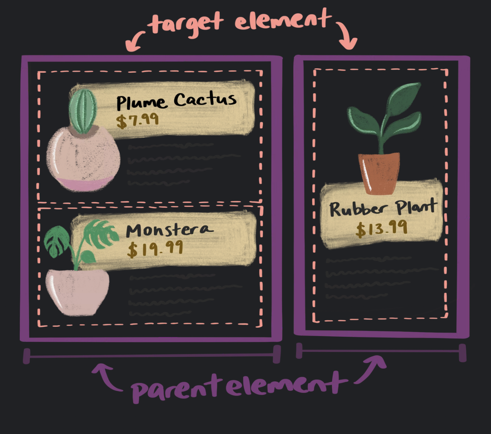

## 마이크로 레이아웃

> 레이아웃을 생각하면 페이지 레벨 디자인을 생각하지만, 페이지 안의 작은 컴포넌트 또한 self-contained layout을 가질 수 있다.\
> 컴포넌트가 어디에 위치할지 모르기 때문에 컴포넌트가 컨테이너 안에 자동으로 조정되도록 해주어야 함

### Grid

> 페이지 레벨 뿐 아니라 페이지 안의 컴포넌트에도 grid를 잘 쓸 수 있음

아래의 `::before`, `::after` pseudo-element 는 heading 양쪽에 선을 만들어주는데, heading은 grid 컨테이너다. 각 element 들이 배치되어 있기 때문에 선은 항상 필요한 공간 만큼 차지하게 된다.

```css
h1 {
	display: grid;
	grid-template-columns: 1fr auto 1fr;
	gap: 1em;
}
h1::before,
h1::after {
	content: '';
	border-top: 0.1em double black;
	align-self: center;
}
```

### Flexbox

> 이름 그대로 컴포넌트를 flexible 하게 만들어줌\
> 컴포넌트의 어떤 요소에 최소/최대 크기를 설정하고 나머지 요소는 그에 따라 변하도록 flex를 줄 수 있음

여기서 이미지는 공간의 1/4을 차지하고, 텍스트는 나머지 3/4를 차지하지만, 이미지는 200px를 넘어서지 않는다.

```css
.media {
	display: flex;
	align-items: center;
	gap: 1em;
}
.media-illustration {
	flex: 1;
	max-inline-size: 200px;
}
.media-content {
	flex: 3;
}
```

### Container queries

> 컴포넌트 자체는 컨텍스트에 대한 이해가 없다. 메인 콘텐츠인지, 사이드바인지 알 수 없음 => 페이지 레이아웃 보다 컴포넌트 레이아웃이 어려움 😢\
> 페이지 레이아웃에서는 컨테이너 너비가 브라우저 뷰포트 너비이고, media queries는 페이지 수준의 컨테이너 너비를 확인한다.

새로운 css 기술은 [container queries](https://developer.mozilla.org/en-US/docs/Web/CSS/CSS_Container_Queries)
로 부모 컨테이너의 dimension 알 수 있음 (it's experimental technology)

먼저 어떤 요소를 컨테이너로 할건지 정함

```css
main,
aside {
    container-type: inline-size;
}
// 인라인 dimension으로 쿼리를 하고 싶다. => horizontal axis
=> 너비 기준으로 스타일 변경
```

컴포넌트가 컨테이너 안에 있는 경우, 미디어쿼리와 비슷하게 스타일을 적용할 수 있음

```css
.media-illustration {
	max-width: 200px;
	margin: auto;
}

@container (min-width: 25em) {
	//컨테이너 안에있는 미디어가 25em보다 작을 때만 다음 스타일들이 적용됨
	.media {
		display: flex;
		align-items: center;
		gap: 1em;
	}

	.media-illustration {
		flex: 1;
	}

	.media-content {
		flex: 3;
	}
}
```



✏️ Container queries are a game-changer for micro layouts. Your components can be self-contained, independent of the browser viewport.

### 쿼리 합치기

> 그렇다면.. 미디어 쿼리는 페이지에, 컴포넌트 쿼리는 페이지 내 컴포넌트에 쓸 수 있죠
