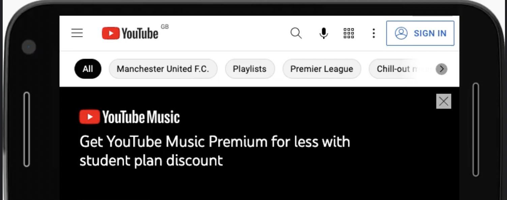

## user interface patterns

### navigation
> 작은 화면일때 네비게이션을 숨기기 쉽지만, 그러면 유저는 두 단계를 거쳐야 함 (클릭 -> 메뉴 열기)\
> 네비게이션을 숨기는 방법을 피할 것

`overflow pattern`: 링크를 한줄에 넣되, 화면에서 스와이프 할 수 있도록 만들기\
디바이스 너비에 맞게 스케일을 할 수 있는 이점이 있음\
모든 링크가 안보인다는 단점\
가장 중요한 링크를 앞쪽에 위치시키면 좋음



최후의 수단으로 네비게이션 숨기기를 씁시다(toggle)
> This is called progressive disclosure\
아이콘보다는 텍스트 라벨의 네비게이션 메뉴가 좋음

### carousel
> 네비게이션에 해당 되는 부분은 다른 콘텐츠에도 적용됨 --최대한 숨기지 않을 것.

작은 화면에는 캐러셀을, 큰 화면에는 그리드로 보여주는 것도 한 방법

```css
@media (max-width: 50em) {
  .cards {
    display: flex;
    flex-direction: row;
    overflow-x: auto;
    scroll-snap-type: inline mandatory;
    scroll-behavior: smooth;
  }
  .cards .card {
    flex-shrink: 0;
    flex-basis: 15em;
    scroll-snap-align: start;
  }
}
```
> 참고로, `overflow-x` 의 logical version은 `overflow-inline` 인데, `scroll-snap-type`과 더 알맞음. 위에 예제는 크로우싱 브라우저 지원을 위한 예시.

`scroll-snap`을 쓰면 아이템이 부드럽게 스와이프 되게 할 수 있음\
`scroll-snap-type: inline mandatory` 으로 아이템은 제 자리에 맞게 snap 됨

너비가 50em 이 넘어가면, 그리드로 바꾼다.
```css
@media (min-width: 50em) {
  .cards {
    display: grid;
    grid-template-columns: repeat(auto-fill, minmax(15em, 1fr));
  }
}
```
[미디어 스크롤러 컴포넌트 만들기](https://web.dev/building-a-media-scroller-component/)\
[캐러셀 web dev 권장사항 읽어볼 글](https://web.dev/carousel-best-practices/)

### 데이터 테이블 
> 표 데이터 구조에는 `table` element를 쓰면 좋지만, 화면이 작을 땐 표가 깨질 수 있는데\
이때 overflow 패턴을 적용하면 좋음

```css
.table-container {
  max-inline-size: 100%;
  overflow-x: auto;
  scroll-snap-type: inline mandatory;
  scroll-behavior: smooth;
}
.table-container th, 
.table-container td {
  scroll-snap-align: start;
  padding: var(--metric-box-spacing);
}
```

### 가이드라인
> 오버플로우 패턴은 작은 화면에 좋지만, 화면에 보이지 않는 콘텐츠도 알 수 있어야 함\
그림자나 그라데이션을 끝에 주어서 잘린 콘텐츠라는 걸 보여주면 좋음 

작은 화면 디자인 -> 큰 화면 디자인으로 가는게 더 슁움

[UI 패턴 글](https://web.dev/patterns/)