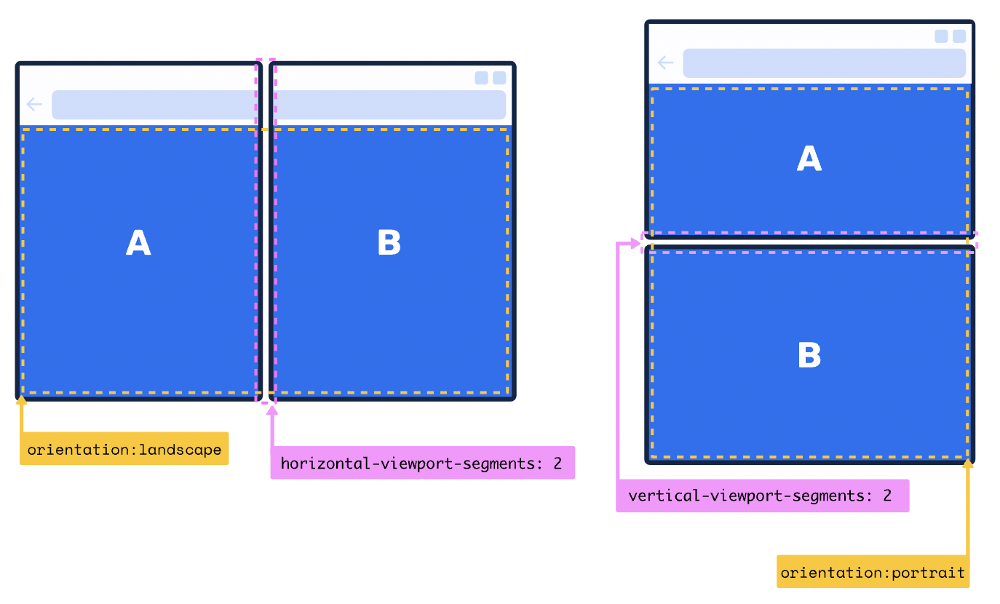

## screen configurations

### viewport segments
> 웹사이드가 듀얼 화면 기기에서 어떤식으로 보여줄지 확인할 수 있는 미디어 피쳐 (실험 단계)

```css
@media (horizontal-viewport-segments: 2) and (vertical-viewport-segments: 1) {
  // Styles for side-by-side screens.
}
@media (vertical-viewport-segments: 2) and (horizontal-viewport-segments: 1) {
  // Styles for stacked screens.
}
```
가로가 2고, 세로가 1이면 콘텐츠가 좌,우로 나뉘어짐\ 
세로가 2고 가로가 1이면 콘텐츠가 위, 아래로 나뉘어짐




### 환경 변수
> viewport-segments 만으로 hinge 부분으르 어떻게 처리할지는 어렵다. 환경변수를 사용하면 해당 hinge 크기를 알 수 있음\
> propasal state 임.. 참고만 일단 합시당 

🚩[env 살펴보기](https://developer.mozilla.org/en-US/docs/Web/CSS/env)

예를 보면 iphone x의 위에 '노치' 부분을 다음과 같이 접근할 수 있다!!
```css
body {
  padding-top: env(safe-area-inset-top, 1em); 
  padding-right: env(safe-area-inset-right);
  padding-bottom: env(safe-area-inset-bottom);
  padding-left: env(safe-area-inset-left);
}
```
환경변수 없는 경우 fallback 옵션 줄수도 있고..(1em)

iphone x에서 환경변수를 작동하게 하려면 뷰포트에 meta 요소를 업데이트 해야한다..!
```html
<meta name="viewport" content="width=device-width, initial-scale=1, viewport-fit=cover">
```