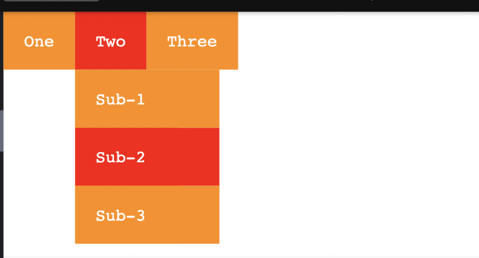
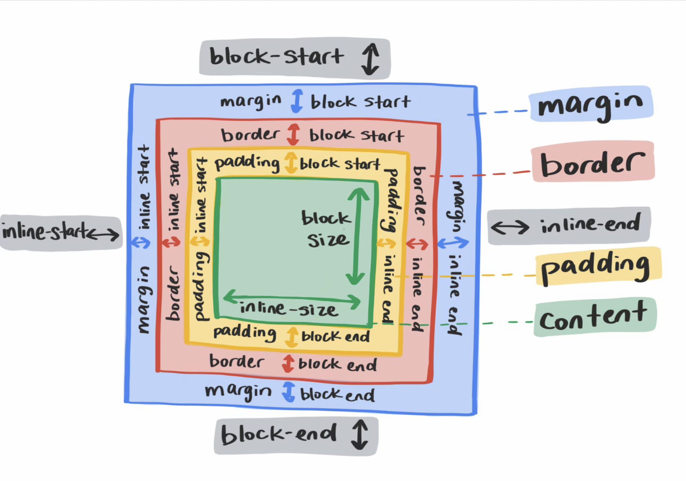
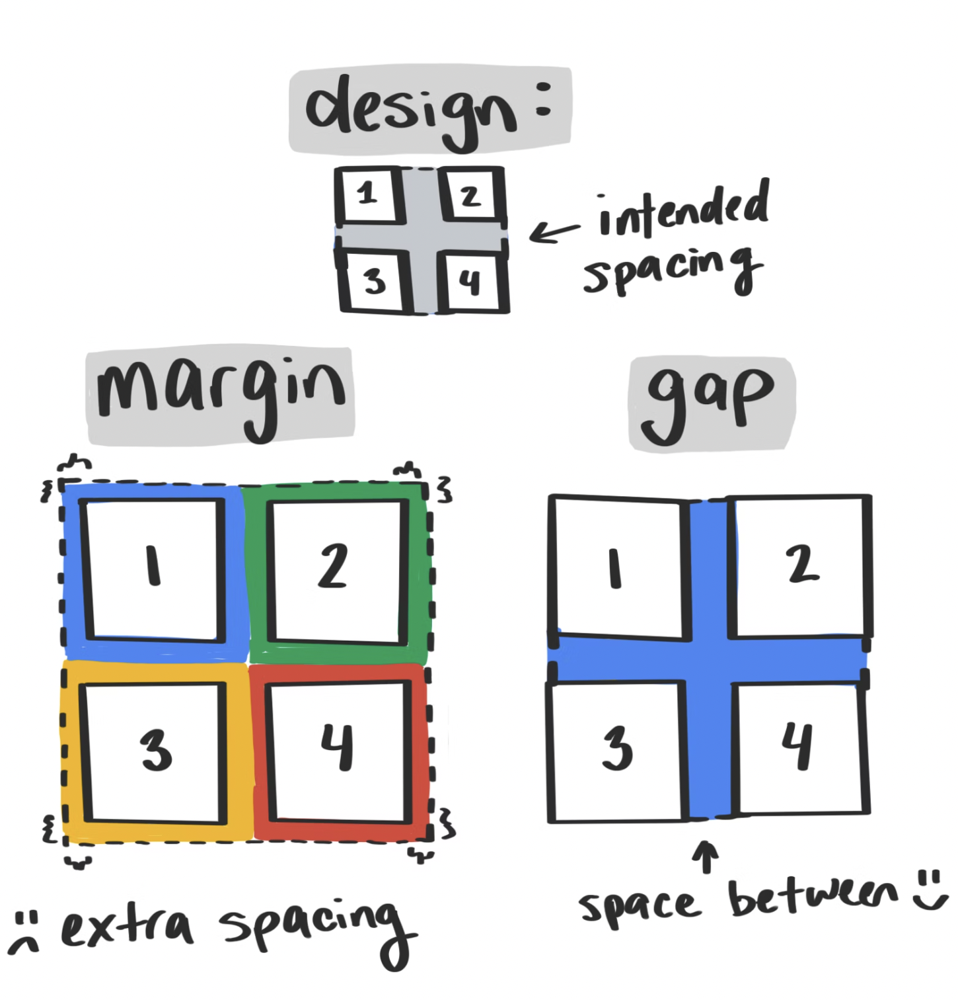

### scroll snap

> 풀 페이지에 쓰려고 했는데 글을 보니, 페이지 보다는 페이지 내의 컴포넌트에 쓰는 게 좋다고 함. 경우에 따라 유저가 컨트롤하지 못하는 느낌 들 수 있기 때문에 주의.

### focus-within

> 자식 노드에 focus 되어있으면 스타일을 적용해랏

```css
li:hover,
li:focus-within {
	background: red;
	cursor: pointer;
}
```



> 이렇게 메뉴의 자식 노드를 hover할때도 부모 & 자식 백그라운드가 적용된 걸 볼 수 있다.

### 미디어 쿼리 레벨 5

> `prefers-*`를 사용하며 브라우저를 시스템 레벨에서 프록시처럼 쓸 수 있다.

- prefers-reduced-motion
- prefers-color-scheme
- prefers-contrast
- prefers-reduced-transparency
- forced-colors
- inverted-colors

### logical properties

> 각 요소는 2개의 크기를 가진다.

- block 차원 -> 텍스트 라인과 수직을 이룸
- inline 차원 -> 텍스트 라인과 평행을 이룸

✏️ 영어에어서는 block-sice = height, inline-size = width



logical property를 쓰면 다른 언어에 맞게 레이아웃을 바꿔야 할때 `writing-mode`와 `direction`을 바꾸면 레이아웃이 알아서 바뀜 !!

### position : sticky

> position:sticky로 설정한 요소는 화면을 벗어나기 전까지 block flow로 남아있는데, 화면에서 벗어나는 순간 스크롤을 멈추고 top value 포지션에 붙어있음\
> 이를 응용해서 다음을 만들 수 있음

- sticky stack
- sticky slide
- sticky desperado

### backdrop-filter

> 해당 프로퍼티를 사용하면 요소 자신이 아니라, 요소 뒤의 요소에 그래픽 효과를 더할 수 있다.\
> [backdrop-filter](https://web.dev/backdrop-filter/)

### is()

`:is()` 수도 클래스가 나온지 10년도 더 됐지만, 생각보다 많이 쓰이지 않고 있다.\
`,`로 나눠진 셀렉터들을 argument로 받아서 매치시켜준다.

```css
button.focus,
button:focus {
  …
}

article > h1,
article > h2,
article > h3,
article > h4,
article > h5,
article > h6 {
  …
}

/* selects the same elements as the code above */
button:is(.focus, :focus) {
  …
}

article > :is(h1,h2,h3,h4,h5,h6) {
  …
}
```

### gap

> `gap`을 사용하면 원하지 않는 여백에 대한 문제를 줄일 수 있다.
> 

### css Houdini

> Houdini 란 low-level의 API 세트(브라우저가 커스텀 css를 어떻게 해석할지 알려주는 브라우저 렌더링 엔진을 위한 것)\
> 즉, css object model에 접근할 수 있도록 해줌

- 커스텀 css 기능 만들기 가능
- 어플 로직과 렌더링 부분 분리
- css polyfilling 보다 더 성능이 좋음, 브라우저가 스크립트를 파싱하고 렌더링 사이클을 또 돌지 않아도 되기 때문에! Houdini 코드는 첫번째 렌더링 사이클에서 파싱됨

### overflow

- size: 높이, 너비 동시에 세팅 가능
- aspect-ration: 비율없는 요소에 비율 세팅
- min(), max(), clamp(): 수학적인 계산 가능
- list-style-type: 있는 기능이지만 이모지나 svg또한 지원가능
- display: outer inner : 이렇게 두 개의 파라미터를 받을 수 있음
- css regions : 정해지지 않은, 각지지 않은 부분의 콘텐츠 내부, 외부를 채울 수 있도록 해줌 (?)
- css modules : 자바스크립트가 css 모듈을 요청해서 오브젝트를 받아 쉽게 퍼포먼스

[자세한 내용 및 코드 데모는 글 링크타고 확인](https://web.dev/next-gen-css-2019/#scroll-snap)

[유튜브 영상 토크 참고](https://youtu.be/-oyeaIirVC0?t=1825)
